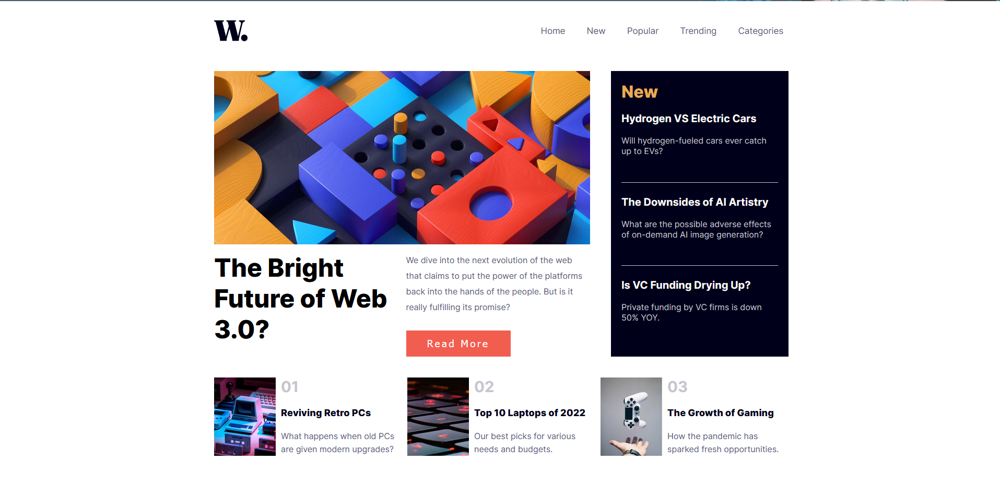

# Frontend Mentor - News homepage solution

This is a solution to the [News homepage challenge on Frontend Mentor](https://www.frontendmentor.io/challenges/news-homepage-H6SWTa1MFl). Frontend Mentor challenges help you improve your coding skills by building realistic projects.

## Table of contents

- [Overview](#overview)
  - [The challenge](#the-challenge)
  - [Screenshot](#screenshot)
  - [Links](#links)
- [My process](#my-process)
  - [Built with](#built-with)
  - [What I learned](#what-i-learned)
- [Author](#author)

## Overview

### The challenge

Users should be able to:

- View the optimal layout for the interface depending on their device's screen size
- See hover and focus states for all interactive elements on the page

### Screenshot

### Links

- Solution URL: (https://github.com/DarmaPutra55/frontend-mentor-news-homepage)
- Live Site URL: (https://darmaputra55-news-page.netlify.app/)

## My process

### Built with

- Semantic HTML5 markup
- CSS custom properties
- Flexbox
- CSS Grid
- [Sass](https://sass-lang.com/)
- [React](https://reactjs.org/) - JS library

### What I learned

What I learned is how to use CSS grid to create responsive website as well how to design the website's display to be similar to the figma.

## Author

- Linkedin - [I Gusti Agung Gede Darma Putra](https://www.linkedin.com/in/i-gusti-agung-gede-darma-putra-0b8025237/)
- Frontend Mentor - [I Gusti Agung Gede Darma Putra](https://www.frontendmentor.io/profile/DarmaPutra55)
